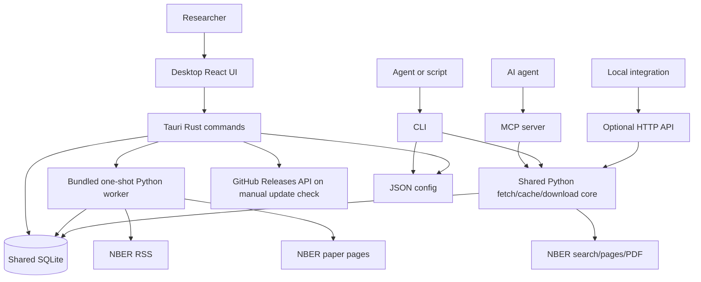

# System Architecture

NBER-CLI 0.10.0 is a desktop-first application with a shared Python core and local SQLite persistence. Desktop is the human interface. CLI and MCP expose the core paper workflows to AI agents and automation. The optional HTTP API is a separate local integration and is not part of the Desktop runtime.

For functional scope, requirements, and evidence traceability, see the [Software Specification](software-specification.md).

## Component Map

The Desktop's Rust layer owns native command dispatch, configuration safety, local Feed reads, read state, and tag tables. NBER Feed and paper network/parsing logic remains in the bundled Python worker, avoiding a second parser implementation.

## Entry Points

| Surface | Primary file or directory | Main role |
| --- | --- | --- |
| Desktop | `desktop/src/`, `desktop/src-tauri/src/` | Researcher-facing local workspace. |
| Console script | `src/nber_cli/cli.py` | AI/script command parsing, text/JSON output, diagnostics, and management commands. |
| Python module | `src/nber_cli/__main__.py` | Runs the same CLI through `python -m nber_cli`. |
| MCP server | `src/nber_cli/mcp/mcp.py` | Exposes three structured tools to agents. |
| Local HTTP API | `src/nber_server/` | Optional loopback endpoints for explicit local integrations. |
| Public Python API | `src/nber_cli/__init__.py` | Defines top-level imports through `__all__`. |
| Desktop worker | `src/nber_cli/desktop_worker.py` | Initializes the database or performs one Feed refresh and metadata-prefetch operation. |

## Core Workflows

| Workflow | Path | Persistence behavior |
| --- | --- | --- |
| Desktop start | React -> Tauri setup -> Rust config/database | Validates and opens an existing schema-v3 database, creates Desktop tag tables for that database, then reads the local Feed. A missing database is allowed until refresh. |
| Desktop refresh | React -> Tauri -> one-shot worker -> Python Feed + conditional metadata functions -> SQLite -> Rust tag sync | Always updates Feed/fetch rows; updates metadata cache and source-tag state only when info cache is enabled; worker exits. |
| Desktop open paper | React -> Tauri -> Rust local database query | Reads `feed_items` + `info_cache`, marks `read_status`; no paper network request. |
| Search | CLI or MCP -> `fetch.search_nber` -> NBER search endpoint | CLI writes `query_log`; MCP does not. |
| Paper info | CLI/MCP/HTTP -> info-cache layer -> NBER page on miss | CLI and MCP info paths write `info_log`; cache writes depend on settings. |
| Download | CLI or MCP -> download engine -> NBER PDF endpoint | CLI writes `download_log`; MCP does not. |
| Feed via CLI/HTTP | Caller -> Feed layer -> NBER RSS -> SQLite | Writes `feed_items` and `feed_fetches`. |
| Config | CLI or Desktop -> config implementation -> JSON | Writes supported settings under `~/.nber-cli/config.json`. |

## Python Core

- `fetch/fetcher.py` retrieves and parses paper pages and remote search results, validates paper identity, and retries eligible failures.
- `fetch/download.py` validates IDs and paths, downloads PDFs with `aiohttp`, and limits batch concurrency.
- `fetch/feed.py` retrieves the public RSS Feed, parses it with `defusedxml`, repairs a narrow unescaped-`<` case, and stores valid paper rows.
- `db/info_cache.py` coordinates metadata cache lookup, refresh, and fallback.
- `db/db.py` defines schema-v3 shared tables, migrations, read state, cache, and operation logs.
- `config/config_store.py` and `config/config.schema.json` manage Python/CLI configuration.

## Desktop Runtime

The React UI uses typed Tauri commands rather than HTTP. Rust directly performs local operations that do not duplicate NBER parsing:

- Read paged Feed rows and cached paper details.
- Update read/unread state.
- Create and maintain Desktop raw, user, and hidden tag tables.
- Validate Desktop config and database location.
- Start the bundled worker for Feed refresh and parse its result. On a new installation, that first refresh also creates the database schema.

The worker uses the same Python Feed and metadata-cache functions as the CLI. It is not a long-running sidecar and does not listen on a port.

## Output and Formatting

- CLI output is human-readable by default; commands with structured contracts support JSON where documented.
- MCP returns dictionaries shaped for agent tools rather than CLI text.
- The optional HTTP API wraps handled outcomes in a shared JSON envelope.
- Desktop receives serialized Rust structures through Tauri commands.
- Desktop citation formatting is a frontend feature and is separate from CLI output formatting.

## Data Ownership and Concurrency

All interfaces may point at the same SQLite file. Shared Python tables use schema version 3. Desktop adds four idempotent extension tables for tags without changing `PRAGMA user_version`.

SQLite provides transactional updates, but file-level backup or manual deletion should occur only after all Desktop, CLI, MCP, and HTTP processes using the database have stopped. See [Persistence](persistence.md) for WAL sidecars, cleanup limits, and online backup.

## Trust Boundaries

- No project account or API key is required, and application code does not upload the local database to project infrastructure.
- CLI enables a lexical current-directory check by default; users may explicitly disable it.
- MCP always normalizes paper IDs and applies the same kind of lexical working-directory check.
- In 0.10.0 these checks do not resolve `..` segments or symbolic links and therefore are not a security sandbox. Use simple relative targets and isolate the process working directory when untrusted input is possible.
- HTTP MCP transports have no built-in authentication and must remain local or sit behind external authentication.
- The optional HTTP API binds to loopback by default; Desktop does not use or start it.
- Desktop opens no listening port. Refresh uses the bundled worker to contact NBER; manual update check contacts GitHub.
- Opening an NBER or Release page and copying to the clipboard require explicit user actions.

## Source-to-Concept Reference

| Concept | Primary paths |
| --- | --- |
| CLI | `src/nber_cli/cli.py`, `src/nber_cli/__main__.py` |
| MCP | `src/nber_cli/mcp/mcp.py` |
| Optional HTTP API | `src/nber_server/main.py`, `src/nber_server/routers/` |
| Desktop UI | `desktop/src/App.tsx`, `desktop/src/pages/`, `desktop/src/components/` |
| Desktop native layer | `desktop/src-tauri/src/commands.rs`, `config.rs`, `database.rs`, `worker.rs` |
| Desktop worker | `src/nber_cli/desktop_worker.py` |
| Search and metadata | `src/nber_cli/fetch/fetcher.py` |
| PDF downloads | `src/nber_cli/fetch/download.py` |
| RSS Feed | `src/nber_cli/fetch/feed.py` |
| Cache and database | `src/nber_cli/db/info_cache.py`, `src/nber_cli/db/db.py` |
| Configuration | `src/nber_cli/config/config_store.py`, `src/nber_cli/config/config.schema.json` |
| Models and formatting | `src/nber_cli/core/models.py`, `src/nber_cli/utils/formatters.py` |
| Tests and release validation | `tests/`, `desktop/src/**/*.test.*`, `scripts/`, `.github/workflows/` |
