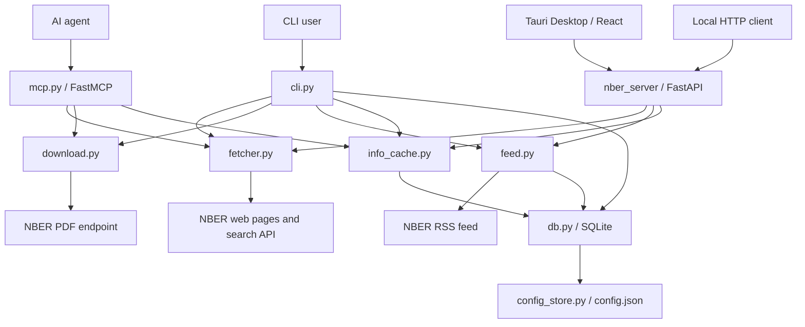

# System Architecture

NBER-CLI is organized as a small layered application. The command line interface, MCP server, local HTTP server, and Tauri Desktop app are entry points; the shared core performs network retrieval, parsing, formatting, downloads, feed processing, and local persistence.

## Component Map

## Entry Points

| Surface | File | Main role |
| --- | --- | --- |
| Console script | `src/nber_cli/cli.py` | Parses arguments, prints text or JSON, records CLI logs, and maps user commands to shared functions. |
| Python module | `src/nber_cli/__main__.py` | Lets users run `python -m nber_cli` with the same behavior as `nber-cli`. |
| MCP server | `src/nber_cli/mcp.py` | Exposes `get_paper_info`, `search_papers`, and `download_paper` for agent clients. |
| Local HTTP server | `src/nber_server/` | Provides loopback health, feed, paper, read-status, and settings endpoints for Desktop and local integrations. |
| Desktop app | `desktop/` | Runs the bundled Python sidecar from Tauri and presents the React research workspace. |
| Public package API | `src/nber_cli/__init__.py` | Defines the top-level stable imports through `__all__`. |

## Core Workflows

| Workflow | Path through the system | Persistence behavior |
| --- | --- | --- |
| Search | `cli.py` or `mcp.py` -> `fetcher.search_nber` -> NBER search API -> `formatters.search_results` | CLI search records `query_log`; MCP search does not. |
| Paper info | `cli.py` or `mcp.py` -> `info_cache.py` -> `db.py` cache lookup -> `fetcher.get_nber` on miss | Reads and writes `info_cache` when enabled; both surfaces record `info_log`. |
| Download | `cli.py` or `mcp.py` -> `download.py` -> NBER PDF endpoint | CLI download records `download_log`; MCP download does not. |
| Feed | `cli.py` -> `feed.py` -> NBER RSS -> `db.py` | Stores feed items in `feed_items` and fetch summaries in `feed_fetches`. |
| Desktop feed | React -> local FastAPI -> `feed.py` / `db.py` | Shares the CLI database and stores per-paper state in `read_status`. |
| Config | `cli.py` -> `config_store.py` | Reads and writes `~/.nber-cli/config.json`. |

## Network Layer

`fetcher.py` retrieves paper pages and search results. It sends browser-like headers for every NBER request, enforces TLS 1.2 for synchronous page loads, retries transient failures, and validates that a fetched paper page matches the requested paper ID.

`download.py` uses `aiohttp` for PDF downloads. Single downloads buffer the full PDF in memory before writing to disk. Batch downloads share a client session and use an `asyncio.Semaphore` to cap concurrency.

`feed.py` fetches the public RSS feed, parses it with `defusedxml`, repairs a narrow class of malformed text containing unescaped `<` characters, and ignores malformed items that cannot produce a paper ID.

## Output and Formatting

The CLI keeps the human-readable output separate from the structured payloads:

- `formatters.info` and `formatters.info_text` format paper metadata.
- `formatters.search_results` and `formatters.search_results_text` format search results.
- `formatters.feed_results` and `formatters.feed_results_text` format RSS feed results.

The MCP server returns dictionaries rather than CLI text. The local HTTP server returns a stable JSON envelope. These surfaces let agents and the Desktop app consume the same underlying data without scraping terminal output.

## Trust Boundaries

NBER-CLI does not require credentials and does not send the local database to project infrastructure. The risky boundary is filesystem writes:

- CLI downloads are restricted to the current directory by default, but users can pass `--restrict false`.
- MCP downloads always normalize the paper ID, restrict writes to the server process working directory, and return an error for paths outside that directory.
- HTTP MCP transport has no built-in authentication. Treat it as local-only unless it is placed behind an authenticating proxy or tunnel.
- The Desktop HTTP server binds to loopback and is intended for local use; exposing it beyond the host requires an explicit security review.

## Source-to-Concept Reference

| Concept | Primary files |
| --- | --- |
| CLI command model | `src/nber_cli/cli.py` |
| Agent tool model | `src/nber_cli/mcp.py` |
| Local HTTP API | `src/nber_server/` |
| Desktop shell | `desktop/src/`, `desktop/src-tauri/` |
| Public Python API | `src/nber_cli/__init__.py`, `docs/en/python-api.md` |
| Search and metadata parsing | `src/nber_cli/fetcher.py` |
| PDF download engine | `src/nber_cli/download.py` |
| RSS feed system | `src/nber_cli/feed.py` |
| Info cache | `src/nber_cli/info_cache.py`, `src/nber_cli/db.py` |
| Local config | `src/nber_cli/config_store.py`, `src/nber_cli/config.schema.json` |
| Local database | `src/nber_cli/db.py` |
