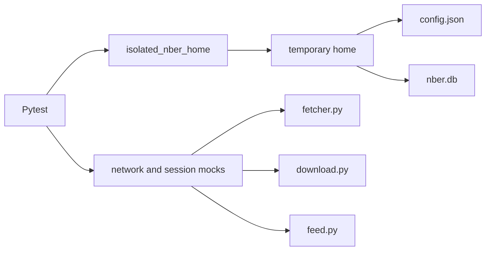

# Test Infrastructure

The repository uses Pytest for Python and release tooling, Vitest for the React frontend, TypeScript builds for frontend contracts, and Cargo checks for the Tauri shell. Automated tests avoid writing into the real home directory and avoid live NBER requests unless an explicit smoke command opts into them.

## Run Tests

```bash
uv run pytest tests
uv run pytest tests/test_cli.py
uv run pytest tests -m "not slow"
cd desktop
npm run lint
npm run test
npm run build
cd src-tauri
cargo check
```

Run linting and documentation checks with:

```bash
uv run ruff check .
uv run --group docs mkdocs build --strict
```

## Test Suite Map

| Area | Representative files | What it covers |
| --- | --- | --- |
| CLI | `tests/test_cli.py`, `tests/test_main.py` | Argument parsing, subcommand behavior, output formats, exit behavior. |
| Network fetcher | `tests/test_fetcher.py` | Paper page parsing, search payload parsing, retry and request behavior. |
| Downloads | `tests/test_downloader.py` | Single and batch download paths, validation, failures, concurrency behavior. |
| Feed | `tests/test_feed.py` | RSS parsing, malformed XML handling, new-item detection, cleanup. |
| Database | `tests/test_db.py`, `tests/test_config_store.py` | Schema creation, config persistence, migration, path normalization, cache tables. |
| Info cache | `tests/test_info_cache.py`, `tests/test_info_cache_flow.py` | Cache hits, refresh behavior, TTL logic, integration with `info`. |
| MCP | `tests/test_mcp.py` | Tool return shapes, error handling, paper ID normalization, download path restrictions. |
| Logging | `tests/test_logging.py`, `tests/test_logs.py` | Log configuration, debug behavior, rotating file setup. |
| Local HTTP server | `tests/test_server.py` | Schema upgrades, envelopes, feed pagination, paper/read state, settings, and external errors. |
| Release metadata | `tests/test_release_metadata.py` | Version synchronization, changelogs, shared tags, and signing policy. |
| Desktop release tools | `tests/test_desktop_*.py` | Sidecar/artifact normalization, signing validation, release checks, and smoke helpers. |
| React workspace | `desktop/src/**/*.test.ts(x)` | Feed rendering, paper detail, citation formatting, and automatic refresh helpers. |

## Isolation Model

The global fixture in `tests/conftest.py` redirects the NBER-CLI home directory behavior into a temporary path. This protects the user's real `~/.nber-cli/config.json`, database, and debug log during test runs.

Tests patch `Path.home()`, database paths, network functions, and HTTP sessions as needed. The goal is that a test can be run repeatedly without depending on the developer's machine state or network access.

Frontend tests use jsdom and mocked API boundaries. Desktop packaging smoke tests create temporary home and install directories; the live-refresh option is the exception that intentionally contacts NBER.



## Mocking Strategy

Network-facing tests mock the lowest practical boundary:

- Synchronous page and feed retrieval patch `_load_text_sync` or `urllib.request.urlopen`.
- Async search and download paths use fake `aiohttp` sessions or async mocks.
- CLI tests patch high-level functions when the test is about argument dispatch rather than parsing NBER responses.

This split keeps parser tests focused on parsing, command tests focused on CLI behavior, and integration-style tests focused on component interaction.

## Async Patterns

Async functions are tested through `pytest-asyncio` or by invoking CLI paths that internally call `asyncio.run`. Download batch tests assert both successful paths and collected failures because `download_multiple_papers` returns a `DownloadBatchResult` instead of raising when individual downloads fail.

## Robustness Coverage

The tests intentionally cover edge cases that are easy to break:

- Paper IDs with and without the `w` prefix.
- Invalid paper IDs and mismatched fetched paper IDs.
- Search pagination limits and date defaults.
- XML entities and malformed RSS text.
- Database schema upgrades and future-schema rejection.
- Download path restrictions for CLI and MCP surfaces.
- Cache refresh, sliding TTL, and cleanup date ranges.
- Local HTTP response shapes, feed pagination, read-state side effects, and settings validation.
- Desktop artifact names, package size/signing checks, bundled sidecar discovery, and installer startup.

## Current CI Boundaries

- Pull requests run Python lint/tests plus frontend lint/tests/build.
- Pull requests do not currently run `cargo check` or launch a real Tauri WebView.
- Full Tauri builds and installer smoke tests run only for `v*` tags or manual Desktop workflow dispatch.
- The installer smoke script calls the sidecar directly and therefore does not detect WebView-only issues such as CORS Origin mismatches.
- Python package CI currently needs a built-wheel installation check to prove that every declared console entry point is present in the artifact.

## Adding Tests

When changing user-visible behavior, add tests at the surface where the behavior is observed. For example, add CLI tests for command output and exit behavior, MCP tests for tool return shapes, and lower-level tests for parser or database helpers.

Keep fixtures local to a test file unless they are reused broadly. If a fixture touches home directories, database files, network calls, or environment variables, make sure it restores state automatically.
