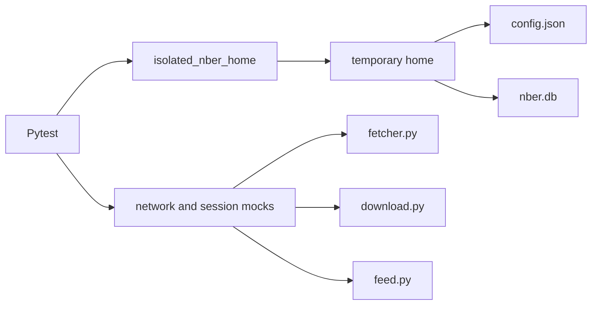

# Test Infrastructure

The test suite is built with Pytest and is designed around isolation. Tests avoid writing into the real home directory, avoid live NBER network calls, and cover both CLI and library behavior.

## Run Tests

```bash
uv run pytest
uv run pytest tests/test_cli.py
uv run pytest -m "not slow"
```

Run linting and documentation checks with:

```bash
uv run ruff check .
uv run --group docs mkdocs build --strict
```

## Test Suite Map

| Area | Representative files | What it covers |
| --- | --- | --- |
| CLI | `tests/test_cli.py`, `tests/test_main.py` | Argument parsing, subcommand behavior, output formats, exit behavior. |
| Network fetcher | `tests/test_fetcher.py` | Paper page parsing, search payload parsing, retry and request behavior. |
| Downloads | `tests/test_downloader.py` | Single and batch download paths, validation, failures, concurrency behavior. |
| Feed | `tests/test_feed.py` | RSS parsing, malformed XML handling, new-item detection, cleanup. |
| Database | `tests/test_db.py`, `tests/test_config_store.py` | Schema creation, config persistence, migration, path normalization, cache tables. |
| Info cache | `tests/test_info_cache.py`, `tests/test_info_cache_flow.py` | Cache hits, refresh behavior, TTL logic, integration with `info`. |
| MCP | `tests/test_mcp.py` | Tool return shapes, error handling, paper ID normalization, download path restrictions. |
| Logging | `tests/test_logging.py`, `tests/test_logs.py` | Log configuration, debug behavior, rotating file setup. |

## Isolation Model

The global fixture in `tests/conftest.py` redirects the NBER-CLI home directory behavior into a temporary path. This protects the user's real `~/.nber-cli/config.json`, database, and debug log during test runs.

Tests patch `Path.home()`, database paths, network functions, and HTTP sessions as needed. The goal is that a test can be run repeatedly without depending on the developer's machine state or network access.



## Mocking Strategy

Network-facing tests mock the lowest practical boundary:

- Synchronous page and feed retrieval patch `_load_text_sync` or `urllib.request.urlopen`.
- Async search and download paths use fake `aiohttp` sessions or async mocks.
- CLI tests patch high-level functions when the test is about argument dispatch rather than parsing NBER responses.

This split keeps parser tests focused on parsing, command tests focused on CLI behavior, and integration-style tests focused on component interaction.

## Async Patterns

Async functions are tested through `pytest-asyncio` or by invoking CLI paths that internally call `asyncio.run`. Download batch tests assert both successful paths and collected failures because `download_multiple_papers` returns a `DownloadBatchResult` instead of raising when individual downloads fail.

## Robustness Coverage

The tests intentionally cover edge cases that are easy to break:

- Paper IDs with and without the `w` prefix.
- Invalid paper IDs and mismatched fetched paper IDs.
- Search pagination limits and date defaults.
- XML entities and malformed RSS text.
- Database schema upgrades and future-schema rejection.
- Download path restrictions for CLI and MCP surfaces.
- Cache refresh, sliding TTL, and cleanup date ranges.

## Adding Tests

When changing user-visible behavior, add tests at the surface where the behavior is observed. For example, add CLI tests for command output and exit behavior, MCP tests for tool return shapes, and lower-level tests for parser or database helpers.

Keep fixtures local to a test file unless they are reused broadly. If a fixture touches home directories, database files, network calls, or environment variables, make sure it restores state automatically.
