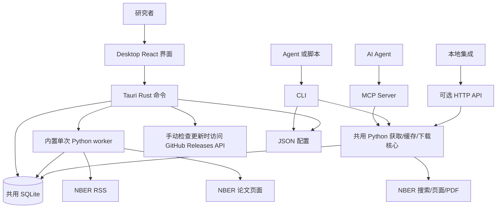

# 系统架构

NBER-CLI 0.10.0 是一个以 Desktop 为主要入口、共用 Python 核心与本地 SQLite 持久化的应用。Desktop 面向人类研究者；CLI 与 MCP 把论文核心流程提供给 AI Agent 和自动化；可选 HTTP API 是独立的本地集成，不属于 Desktop 运行时。

功能范围、要求和证据追溯见[软件规格说明](software-specification.md)。

## 组件图

Desktop 的 Rust 层负责原生命令分发、配置安全、本地 Feed 读取、已读状态和标签表。NBER Feed 与论文的网络请求和解析仍由内置 Python worker 完成，避免维护第二套解析器。

## 入口

| 入口 | 主要文件或目录 | 主要职责 |
| --- | --- | --- |
| Desktop | `desktop/src/`、`desktop/src-tauri/src/` | 面向研究者的本地工作台。 |
| Console script | `src/nber_cli/cli.py` | AI/脚本命令解析、文本/JSON 输出、诊断与管理命令。 |
| Python module | `src/nber_cli/__main__.py` | 通过 `python -m nber_cli` 运行同一 CLI。 |
| MCP Server | `src/nber_cli/mcp/mcp.py` | 向 Agent 暴露三个结构化工具。 |
| 本地 HTTP API | `src/nber_server/` | 为显式本地集成提供可选 loopback 接口。 |
| 公共 Python API | `src/nber_cli/__init__.py` | 通过 `__all__` 定义顶层导入。 |
| Desktop worker | `src/nber_cli/desktop_worker.py` | 初始化数据库，或执行一次 Feed 刷新和元数据预取。 |

## 核心流程

| 流程 | 路径 | 持久化行为 |
| --- | --- | --- |
| Desktop 启动 | React -> Tauri setup -> Rust 配置/数据库 | 校验并打开已经存在的 schema-v3 数据库，为该数据库创建 Desktop 标签表，再读取本地 Feed；数据库不存在时允许空 Feed 启动，直到刷新。 |
| Desktop 刷新 | React -> Tauri -> 单次 worker -> Python Feed + 条件元数据函数 -> SQLite -> Rust 标签同步 | 始终更新 Feed/刷新记录；只有 info cache 开启时才更新元数据缓存和来源标签状态，worker 随后退出。 |
| Desktop 打开论文 | React -> Tauri -> Rust 本地数据库查询 | 读取 `feed_items` + `info_cache`，更新 `read_status`；不请求论文网络页面。 |
| 搜索 | CLI 或 MCP -> `fetch.search_nber` -> NBER 搜索端点 | CLI 写 `query_log`，MCP 不写。 |
| 论文信息 | CLI/MCP/HTTP -> info cache -> 未命中时访问 NBER 页面 | CLI 与 MCP info 路径写 `info_log`；缓存写入取决于设置。 |
| 下载 | CLI 或 MCP -> 下载引擎 -> NBER PDF 端点 | CLI 写 `download_log`，MCP 不写。 |
| CLI/HTTP Feed | 调用方 -> Feed 层 -> NBER RSS -> SQLite | 写入 `feed_items` 和 `feed_fetches`。 |
| 配置 | CLI 或 Desktop -> 配置实现 -> JSON | 在 `~/.nber-cli/config.json` 写入支持的设置。 |

## Python 核心

- `fetch/fetcher.py` 获取并解析论文页面和远程搜索结果，校验论文编号，对符合条件的失败重试。
- `fetch/download.py` 校验编号和路径，用 `aiohttp` 下载 PDF，并限制批量并发。
- `fetch/feed.py` 获取公开 RSS，用 `defusedxml` 解析，修复一类未转义 `<`，保存有效论文记录。
- `db/info_cache.py` 协调元数据缓存查找、刷新与回退。
- `db/db.py` 定义 schema-v3 共用表、迁移、已读状态、缓存和操作日志。
- `config/config_store.py` 与 `config/config.schema.json` 管理 Python/CLI 配置。

## Desktop 运行时

React 界面使用带类型的 Tauri 命令，不使用 HTTP。Rust 直接执行不会重复 NBER 解析逻辑的本地操作：

- 读取分页 Feed 和缓存论文详情。
- 更新已读/未读状态。
- 创建和维护 Desktop 原始、用户与隐藏标签表。
- 校验 Desktop 配置和数据库位置。
- 在 Feed 刷新时启动内置 worker 并解析结果；全新安装的第一次刷新也会创建数据库 schema。

Worker 使用与 CLI 相同的 Python Feed 与元数据缓存函数。它不是长期运行的 sidecar，也不监听端口。

## 输出与格式化

- CLI 默认输出可读文本，在有结构化契约的命令中按文档提供 JSON。
- MCP 返回适合 Agent 工具的 dictionary，不返回 CLI 文本。
- 可选 HTTP API 对已处理结果使用统一 JSON envelope。
- Desktop 通过 Tauri 命令接收序列化的 Rust 结构。
- Desktop 引用格式化属于前端功能，与 CLI 输出格式化相互独立。

## 数据归属与并发

所有入口都可以指向同一 SQLite 文件。共用 Python 表使用 schema 版本 3；Desktop 增加四张幂等标签扩展表，但不修改 `PRAGMA user_version`。

SQLite 为更新提供事务能力，但进行文件级备份或手动删除前，应停止所有使用该数据库的 Desktop、CLI、MCP 与 HTTP 进程。WAL sidecar、清理限制和在线备份见[持久化层](persistence.md)。

## 信任边界

- 不需要项目账号或 API Key，应用代码不会把本地数据库上传到项目方基础设施。
- CLI 默认启用当前目录字面检查；用户可以显式关闭。
- MCP 始终规范化论文编号，并执行同类工作目录字面检查。
- 0.10.0 的检查不会解析 `..` 片段或符号链接，因此不是安全沙箱。输入不可信时，应使用简单相对目标，并隔离进程工作目录。
- MCP HTTP 传输没有内置认证，必须保持本地使用或增加外部认证。
- 可选 HTTP API 默认绑定 loopback；Desktop 不使用也不启动它。
- Desktop 不监听端口。刷新时由内置 worker 访问 NBER；手动检查更新时访问 GitHub。
- 打开 NBER/Release 页面和写入剪贴板都需要用户明确操作。

## 概念与源码对应

| 概念 | 主要路径 |
| --- | --- |
| CLI | `src/nber_cli/cli.py`、`src/nber_cli/__main__.py` |
| MCP | `src/nber_cli/mcp/mcp.py` |
| 可选 HTTP API | `src/nber_server/main.py`、`src/nber_server/routers/` |
| Desktop 界面 | `desktop/src/App.tsx`、`desktop/src/pages/`、`desktop/src/components/` |
| Desktop 原生层 | `desktop/src-tauri/src/commands.rs`、`config.rs`、`database.rs`、`worker.rs` |
| Desktop worker | `src/nber_cli/desktop_worker.py` |
| 搜索与元数据 | `src/nber_cli/fetch/fetcher.py` |
| PDF 下载 | `src/nber_cli/fetch/download.py` |
| RSS Feed | `src/nber_cli/fetch/feed.py` |
| 缓存与数据库 | `src/nber_cli/db/info_cache.py`、`src/nber_cli/db/db.py` |
| 配置 | `src/nber_cli/config/config_store.py`、`src/nber_cli/config/config.schema.json` |
| 模型与格式化 | `src/nber_cli/core/models.py`、`src/nber_cli/utils/formatters.py` |
| 测试与发布校验 | `tests/`、`desktop/src/**/*.test.*`、`scripts/`、`.github/workflows/` |
