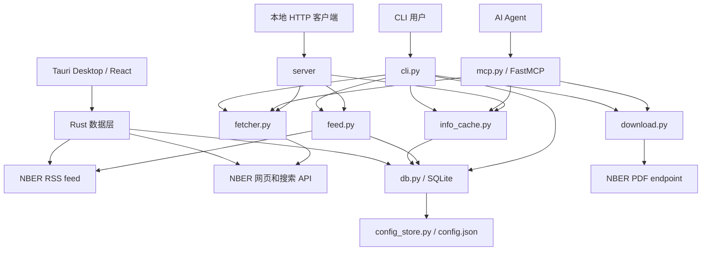

# 系统架构

NBER-CLI 是一个小型分层应用。命令行、MCP server、本地 HTTP server 和 Tauri Desktop 应用都是入口；共享核心负责网络获取、解析、格式化、下载、feed 处理和本地持久化。

## 组件图

## 入口

| 入口 | 文件 | 主要职责 |
| --- | --- | --- |
| Console script | `src/nber_cli/cli.py` | 解析参数、打印文本或 JSON、记录 CLI 日志，并把用户命令映射到共享函数。 |
| Python module | `src/nber_cli/__main__.py` | 支持 `python -m nber_cli`，行为与 `nber-cli` 一致。 |
| MCP server | `src/nber_cli/mcp.py` | 为 Agent 客户端暴露 `get_paper_info`、`search_papers` 和 `download_paper`。 |
| 本地 HTTP server | `src/nber_server/` | 为本地集成提供可选的 loopback 健康检查、feed、论文、已读状态和设置接口。 |
| Desktop 应用 | `desktop/` | 通过 Rust 命令请求 NBER 并直接读写 SQLite，再呈现 React 研究工作台。 |
| 公共包 API | `src/nber_cli/__init__.py` | 通过 `__all__` 定义稳定的顶层导入。 |

## 核心流程

| 流程 | 系统路径 | 持久化行为 |
| --- | --- | --- |
| 搜索 | `cli.py` 或 `mcp.py` -> `fetcher.search_nber` -> NBER 搜索 API -> `formatters.search_results` | CLI 搜索写入 `query_log`；MCP 搜索不写。 |
| 论文信息 | `cli.py` 或 `mcp.py` -> `info_cache.py` -> `db.py` 缓存读取 -> 未命中时 `fetcher.get_nber` | 缓存开启时读写 `info_cache`；两个入口都会写 `info_log`。 |
| 下载 | `cli.py` 或 `mcp.py` -> `download.py` -> NBER PDF endpoint | CLI 下载写入 `download_log`；MCP 下载不写。 |
| Feed | `cli.py` -> `feed.py` -> NBER RSS -> `db.py` | 写入 `feed_items` 和 `feed_fetches`。 |
| Desktop feed | React -> Tauri 命令 -> Rust 网络/SQLite 模块 | 读取共享的 `feed.db-path`，更新 RSS 数据，并把逐篇状态写入 `read_status`。 |
| 配置 | `cli.py` -> `config_store.py` | 读写 `~/.nber-cli/config.json`。 |

## 网络层

`fetcher.py` 负责获取论文页面和搜索结果。它在每次 NBER 请求中发送类浏览器请求头，对同步页面加载强制使用 TLS 1.2，对临时失败进行重试，并校验获取到的论文页面是否匹配请求的论文编号。

`download.py` 使用 `aiohttp` 下载 PDF。单篇下载会先把完整 PDF 放入内存再写入磁盘。批量下载共享同一个 client session，并用 `asyncio.Semaphore` 控制并发。

`feed.py` 获取公开 RSS feed，用 `defusedxml` 解析 XML，修复一类文本中未转义 `<` 的问题，并跳过无法提取论文编号的坏条目。

## 输出与格式化

CLI 把人类可读输出和结构化 payload 分开：

- `formatters.info` 和 `formatters.info_text` 格式化论文元数据。
- `formatters.search_results` 和 `formatters.search_results_text` 格式化搜索结果。
- `formatters.feed_results` 和 `formatters.feed_results_text` 格式化 RSS feed 结果。

MCP server 返回字典而不是 CLI 文本。可选本地 HTTP API 对明确结果使用统一 JSON envelope。Desktop 直接从 Tauri 命令接收带类型的数据，不再使用 HTTP。

## 信任边界

NBER-CLI 不需要凭据，也不会把本地数据库发送到项目基础设施。需要重点注意的边界是文件写入：

- CLI 下载默认限制在当前目录内，但用户可以传 `--restrict false`。
- MCP 下载始终规范化论文编号，把写入限制在 server 进程工作目录内，并对目录外路径返回错误。
- HTTP MCP transport 没有内建认证。除非放在带认证的代理或隧道之后，否则应按本地服务处理。
- Desktop 不监听任何端口；Rust 网络层只在刷新、加载论文或检查更新时访问 NBER/GitHub。

## 概念与源码对应

| 概念 | 主要文件 |
| --- | --- |
| CLI 命令模型 | `src/nber_cli/cli.py` |
| Agent 工具模型 | `src/nber_cli/mcp.py` |
| 本地 HTTP API | `src/nber_server/` |
| Desktop shell | `desktop/src/`、`desktop/src-tauri/` |
| 公共 Python API | `src/nber_cli/__init__.py`、`docs/zh/python-api.md` |
| 搜索与元数据解析 | `src/nber_cli/fetcher.py` |
| PDF 下载引擎 | `src/nber_cli/download.py` |
| RSS feed 系统 | `src/nber_cli/feed.py` |
| Info cache | `src/nber_cli/info_cache.py`、`src/nber_cli/db.py` |
| 本地配置 | `src/nber_cli/config_store.py`、`src/nber_cli/config.schema.json` |
| 本地数据库 | `src/nber_cli/db.py` |
