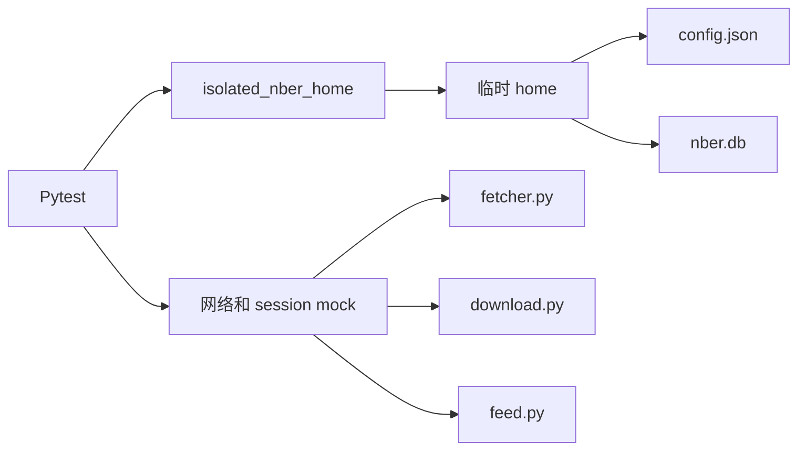

# 测试基础设施

仓库使用 Pytest 测试 Python 与发布工具，使用 Vitest 测试 React 前端，通过 TypeScript build 检查前端契约，并用 Cargo 检查 Tauri 外壳。除非明确运行允许联网的 smoke 命令，自动化测试不会写入真实 home 目录，也不依赖真实 NBER 请求。

## 运行测试

```bash
uv run pytest tests
uv run pytest tests/test_cli.py
uv run pytest tests -m "not slow"
cd desktop
npm run lint
npm run test
npm run build
cd src-tauri
cargo check
```

运行 lint 和文档检查：

```bash
uv run ruff check .
uv run --group docs mkdocs build --strict
```

## 测试套件地图

| 范围 | 代表文件 | 覆盖内容 |
| --- | --- | --- |
| CLI | `tests/test_cli.py`、`tests/test_main.py` | 参数解析、子命令行为、输出格式、退出行为。 |
| 网络获取 | `tests/test_fetcher.py` | 论文页面解析、搜索 payload 解析、重试和请求行为。 |
| 下载 | `tests/test_downloader.py` | 单篇和批量下载路径、校验、失败和并发行为。 |
| Feed | `tests/test_feed.py` | RSS 解析、坏 XML 处理、新条目识别和清理。 |
| 数据库 | `tests/test_db.py`、`tests/test_config_store.py` | Schema 创建、配置持久化、迁移、路径规范化和缓存表。 |
| Info cache | `tests/test_info_cache.py`、`tests/test_info_cache_flow.py` | 缓存命中、refresh 行为、TTL 逻辑、与 `info` 集成。 |
| MCP | `tests/test_mcp.py` | 工具返回形状、错误处理、论文编号规范化、下载路径限制。 |
| 日志 | `tests/test_logging.py`、`tests/test_logs.py` | 日志配置、调试行为、轮转文件设置。 |
| 本地 HTTP server | `tests/test_server.py` | Schema 升级、envelope、Feed 分页、论文/已读状态、设置和外部错误。 |
| 发布元数据 | `tests/test_release_metadata.py` | 版本同步、changelog、共用 tag 和签名策略。 |
| Desktop 发布工具 | `tests/test_desktop_*.py` | Sidecar/产物命名、签名校验、发布检查和 smoke 工具。 |
| React 工作台 | `desktop/src/**/*.test.ts(x)` | Feed 渲染、论文详情、引用格式和自动刷新辅助逻辑。 |

## 隔离模型

`tests/conftest.py` 中的全局 fixture 会把 NBER-CLI 的 home 目录行为重定向到临时路径。这样测试不会碰到用户真实的 `~/.nber-cli/config.json`、数据库和 debug log。

测试会按需 patch `Path.home()`、数据库路径、网络函数和 HTTP session。目标是让测试能反复运行，不依赖开发者机器状态或网络可用性。

前端测试使用 jsdom 和 mock API 边界。Desktop 安装包 smoke test 会创建临时 home 和安装目录；其中 live-refresh 选项是会主动访问 NBER 的例外。



## Mock 策略

网络相关测试会在尽量低且清晰的边界 mock：

- 同步页面和 feed 获取会 patch `_load_text_sync` 或 `urllib.request.urlopen`。
- 异步搜索和下载路径使用假的 `aiohttp` session 或 async mock。
- 当测试重点是参数分发而不是 NBER 响应解析时，CLI 测试会 patch 高层函数。

这种拆分让解析器测试专注解析，命令测试专注 CLI 行为，偏集成的测试专注组件交互。

## 异步模式

异步函数通过 `pytest-asyncio` 测试，或通过内部调用 `asyncio.run` 的 CLI 路径间接测试。批量下载测试同时断言成功路径和收集到的失败，因为 `download_multiple_papers` 在单篇失败时返回 `DownloadBatchResult`，而不是直接抛错。

## 健壮性覆盖

测试会刻意覆盖容易出错的边界：

- 带或不带 `w` 前缀的论文编号。
- 无效论文编号，以及请求编号与获取页面编号不一致。
- 搜索分页限制和日期默认值。
- XML entity 和格式不完美的 RSS 文本。
- 数据库 schema 升级和未来 schema 拒绝。
- CLI 与 MCP 的下载路径限制。
- Cache refresh、滑动 TTL 和按日期清理。
- 本地 HTTP 响应结构、Feed 分页、已读状态副作用和设置校验。
- Desktop 产物命名、体积/签名检查、内置 sidecar 定位和安装包启动。

## 当前 CI 边界

- PR 会运行 Python lint/test，以及前端 lint/test/build。
- PR 当前不会运行 `cargo check`，也不会启动真实 Tauri WebView。
- 完整 Tauri build 和安装包 smoke test 只在 `v*` tag 或手动触发 Desktop workflow 时运行。
- 安装包 smoke 脚本直接请求 sidecar，因此无法发现只在 WebView 中出现的问题，例如 CORS Origin 不匹配。
- Python 包 CI 仍需要增加“安装构建后的 wheel”检查，才能证明每个已声明 console entry point 确实存在于产物中。

## 添加测试

修改用户可见行为时，应在行为被观察到的入口添加测试。例如命令输出和退出行为放在 CLI 测试，工具返回形状放在 MCP 测试，解析或数据库细节放在更低层测试。

除非多个文件都会复用，否则 fixture 尽量留在本测试文件内。任何碰到 home 目录、数据库文件、网络调用或环境变量的 fixture，都要确保自动恢复状态。
